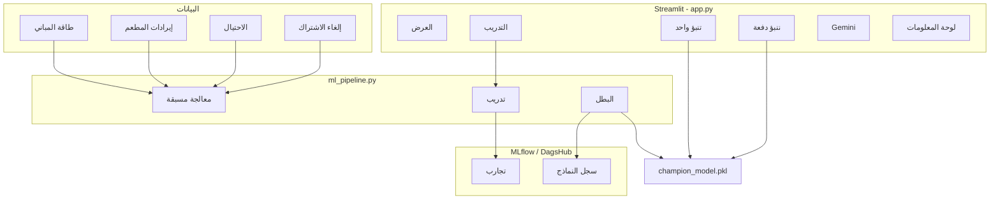

# 🧠 SmartBI — دليل شامل (عربي)

> **منصة MLOps**: واجهة Streamlit · 4 مجموعات بيانات · 8 نماذج ML · تتبع MLflow/DagsHub · تنبؤات · Google Gemini · سجل عمليات.

هذا الدليل يشرح **كل شيء** في التطبيق لتفهمه وتعرضه أمام اللجنة.

---

## فهرس المحتويات

1. [نظرة عامة](#1-نظرة-عامة)
2. [البنية التقنية](#2-البنية-التقنية)
3. [التثبيت](#3-التثبيت)
4. [هيكل المشروع](#4-هيكل-المشروع)
5. [مجموعات البيانات الأربع](#5-مجموعات-البيانات-الأربع)
6. [النماذج الثمانية](#6-النماذج-الثمانية)
7. [الشريط الجانبي](#7-الشريط-الجانبي)
8. [الصفحات الست — شرح تفصيلي](#8-الصفحات-الست--شرح-تفصيلي)
9. [مسارات العمل الكاملة](#9-مسارات-العمل-الكاملة)
10. [نموذج البطل Champion و MLflow](#10-نموذج-البطل-champion-و-mlflow)
11. [المقاييس](#11-المقاييس)
12. [سجل العمليات](#12-سجل-العمليات)
13. [سيناريو العرض (10 دقائق)](#13-سيناريو-العرض-10-دقائق)
14. [حل المشاكل](#14-حل-المشاكل)
15. [الاختبارات التلقائية](#15-الاختبارات-التلقائية)

---

## 1. نظرة عامة

### المشكلة

الشركات لديها بيانات (طاقة، مبيعات، احتيال، اشتراكات) لكن تواجه صعوبة في:
- **فهمها** بسرعة؛
- تحويلها إلى **تنبؤات**؛
- **توثيق** كل تجربة تعلم آلي.

### الحل

تطبيق ويب واحد يربط:

```
CSV → تنظيف → تدريب (عدة نماذج) → أفضل نموذج (البطل) → تنبؤ (سطر أو ملف) → Gemini → رسوم + سجلات
```

### طبقات النظام

| الطبقة | التقنية | الدور |
|--------|---------|-------|
| **الواجهة** | Streamlit | 6 تبويبات، نماذج، رسوم |
| **البيانات** | pandas + CSV | تحميل واستكشاف |
| **ML** | scikit-learn, XGBoost | تدريب ومقاييس |
| **MLOps** | MLflow + DagsHub | تتبع بعيد ونسخ النماذج |
| **الذكاء الاصطناعي** | Gemini | تحليل بلغة طبيعية |
| **التتبع** | `logger.py` | ملف `app_logs.jsonl` |

---

## 2. البنية التقنية



### الملفات الرئيسية

| الملف | الوظيفة |
|-------|---------|
| `app.py` | التطبيق الكامل (6 تبويبات) |
| `config.py` | الإعدادات والمفاتيح |
| `ml_pipeline.py` | التدريب و MLflow والبطل |
| `gemini_ai.py` | تحليل Gemini |
| `logger.py` | السجلات |
| `test_app.py` | اختبارات تلقائية |
| `requirements.txt` | المكتبات (يشمل `statsmodels`) |

---

## 3. التثبيت

```bash
git clone https://github.com/aminexfrad/ai_business_app.git
cd ai_business_app
pip install -r requirements.txt
```

### ملف `.env`

```env
DAGSHUB_USERNAME=aminexfrad
DAGSHUB_TOKEN=رمز_dagshub
DAGSHUB_REPO_NAME=ai_business_app
GOOGLE_API_KEY=مفتاح_gemini
```

### التشغيل

```bash
streamlit run app.py
```

الرابط: **http://localhost:8501**

### التحقق

```bash
python test_app.py
```

يجب أن يظهر: `ALL CHECKS PASSED`

---

## 4. هيكل المشروع

```
ai_business_app/
├── app.py
├── config.py
├── ml_pipeline.py
├── gemini_ai.py
├── logger.py
├── test_app.py
├── requirements.txt
├── *.csv (4 ملفات)
├── README.fr.md
├── README.ar.md
└── .streamlit/config.toml
```

---

## 5. مجموعات البيانات الأربع

| الرمز | الاسم | النوع | الهدف | الصفوف |
|-------|-------|-------|-------|--------|
| 🏢 | طاقة المباني | انحدار | `energy_consumption` | 850 |
| 🍽️ | إيرادات المطعم | انحدار | `monthly_revenue` | 800 |
| 🔍 | كشف الاحتيال | تصنيف | `fraud` (0/1) | 900 |
| 📺 | إلغاء الاشتراك | تصنيف | `subscription_cancelled` | 750 |

---

## 6. النماذج الثمانية

### انحدار (رقم)
Linear Regression · Random Forest · Gradient Boosting · XGBoost

### تصنيف (فئة)
Logistic Regression · Random Forest · Gradient Boosting · XGBoost

### المعالجة المسبقة التلقائية
1. حذف صفوف بدون هدف  
2. تعويض القيم الناقصة  
3. توحيد الأرقام (StandardScaler)  
4. ترميز الفئات (One-Hot)  
5. تقسيم 80٪ تدريب / 20٪ اختبار  

---

## 7. الشريط الجانبي

| العنصر | الوظيفة |
|--------|---------|
| **Select Dataset** | تغيير مجموعة البيانات |
| **Task / Target / Shape** | معلومات أساسية |
| **Champion** | حالة النموذج الجاهز |
| **Load Champion from MLflow** | تحميل من السحابة |
| **روابط** | DagsHub و GitHub |

---

## 8. الصفحات الست — شرح تفصيلي

---

### 🏠 الصفحة 1 — العرض التقديمي (Présentation)

**الهدف:** مقدمة المشروع للجنة.

**المحتوى:**
- وصف المشكلة والحل
- 4 مؤشرات (datasets، نماذج، مهام، نشر)
- البنية: بيانات → ML → MLOps → تطبيق
- تفاصيل كل dataset
- قائمة التقنيات

**إجراء المستخدم:** قراءة فقط.

**جملة للعرض:**  
« هذه الصفحة تقدم المنصة التي تجمع التحليل والتدريب الموثّق والتنبؤ على بيانات أعمال حقيقية. »

---

### ⚙️ الصفحة 2 — التدريب و MLflow

**الهدف:** تدريب ومقارنة النماذج وحفظها في MLflow.

**المحتوى:**
- إحصائيات ومعاينة البيانات
- اختيار النماذج (multiselect)
- زر **Lancer l'entraînement & Tracker avec MLflow**

**عند الضغط:**
1. اتصال DagsHub  
2. تدريب كل نموذج + تسجيل run  
3. اختيار **البطل** 🏆  
4. حفظ `champion_model.pkl`  
5. تسجيل في Model Registry  
6. جدول مقارنة + رسم بياني  
7. رابط DagsHub  

**جملة للعرض:**  
« هنا نقارن عدة خوارزميات ونختار الأفضل تلقائياً ونوثّق كل شيء في MLflow. »

---

### 🎯 الصفحة 3 — تنبؤ لسطر واحد

**الهدف:** تنبؤ لحالة واحدة (عميل، مبنى، معاملة).

**الشروط:** نموذج البطل محمّل.

**ترتيب التحميل:**
1. الذاكرة (session)  
2. الملف `champion_model.pkl`  
3. وإلا تحذير

**المحتوى:**
- حقول أرقام وقوائم للفئات  
- زر **Prédire**  
- نتيجة + احتمالات (تصنيف)  
- تفسير Gemini (اختياري)  

**جملة للعرض:**  
« محاكاة مدير يدخل بيانات عميل ويحصل على تنبؤ فوري. »

---

### 📦 الصفحة 4 — تنبؤ دفعة (Batch CSV)

**الهدف:** تنبؤ لآلاف الصفوف دفعة واحدة.

**الخطوات:**
1. تحميل القالب (template)  
2. رفع CSV بنفس الأعمدة (بدون الهدف)  
3. **Lancer la prédiction batch**  
4. تحميل `predictions_batch.csv`  
5. رسم توزيع التنبؤات  

**جملة للعرض:**  
« سيناريو الإنتاج: الشركة ترسل ملفاً وتحصل على النتائج لكل الصفوف. »

---

### 🤖 الصفحة 5 — تحليل Gemini

**الهدف:** أسئلة بلغة طبيعية عن البيانات.

**الشروط:** `GOOGLE_API_KEY` + رصيد API.

**المحتوى:**
- إحصائيات  
- أسئلة جاهزة أو سؤال مخصص  
- زر **Analyser avec Gemini**  

**النموذج:** `gemini-2.0-flash`

| الدالة | المكان |
|--------|--------|
| `analyze_dataset` | هذا التبويب |
| `analyze_prediction_result` | بعد تنبؤ واحد |
| `analyze_batch_results` | بعد batch |

---

### 📊 الصفحة 6 — لوحة المعلومات (Dashboard)

**الهدف:** استكشاف بصري + سجلات MLOps.

| القسم | ماذا يعرض |
|-------|-----------|
| KPIs | عدد الصفوف والأعمدة |
| توزيع الهدف | histogram أو pie + box |
| الارتباط | heatmap |
| feature vs هدف | scatter + OLS أو box |
| فئات | histogram |
| مقارنة نماذج | إن وُجد تدريب في الجلسة |
| السجلات | آخر 30 حدث |

> يحتاج scatter مع `trendline="ols"` إلى مكتبة **`statsmodels`** (موجودة في requirements).

---

## 9. مسارات العمل الكاملة

### المسار أ — من الصفر إلى التنبؤ

| # | الإجراء | التبويب |
|---|---------|---------|
| 1 | `pip install -r requirements.txt` | طرفية |
| 2 | إنشاء `.env` | — |
| 3 | `streamlit run app.py` | — |
| 4 | اختيار dataset | الشريط الجانبي |
| 5 | تدريب النماذج | التدريب |
| 6 | التحقق من البطل 🏆 | التدريب |
| 7 | تنبؤ | تنبؤ واحد |
| 8 | (اختياري) رسوم | Dashboard |
| 9 | (اختياري) Gemini | تحليل IA |

### المسار ب — جلسة سابقة (MLflow)

1. تشغيل التطبيق  
2. **Load Champion from MLflow**  
3. تنبؤ مباشرة  

### المسار ج — batch للشركة

1. بطل محمّل  
2. تحميل template  
3. رفع CSV  
4. تنزيل النتائج  

### المسار د — استكشاف فقط (بدون تدريب)

1. اختيار dataset  
2. Dashboard + (اختياري) Gemini  

---

## 10. نموذج البطل Champion و MLflow

### ما هو البطل؟

أفضل نموذج بعد المقارنة:
- انحدار → أعلى **R²**
- تصنيف → أعلى **F1**

### أين يُحفظ؟

| المكان | |
|--------|---|
| Session | `champion_pipeline` |
| محلي | `champion_model.pkl` |
| سحابة | MLflow Registry على DagsHub |

---

## 11. المقاييس

### انحدار
- **RMSE** — خطأ (أقل أفضل)
- **MAE** — متوسط خطأ مطلق
- **R²** — جودة (قريب من 1 ممتاز)

### تصنيف
- **Accuracy** — دقة عامة
- **F1** — يختار البطل
- **Precision / Recall / AUC**

---

## 12. سجل العمليات

ملف: **`app_logs.jsonl`**

| الحدث | متى |
|-------|-----|
| `training` | بعد التدريب |
| `prediction` | تنبؤ واحد |
| `batch_upload` | batch |
| `gemini_query` | سؤال Gemini |

يُعرض في Dashboard.

---

## 13. سيناريو العرض (10 دقائق)

| الوقت | ماذا تفعل |
|-------|-----------|
| 0:00 | مقدمة — تبويب العرض |
| 0:30 | اختر **كشف الاحتيال** |
| 1:30 | درّب 4 نماذج |
| 4:00 | جدول + DagsHub |
| 4:30 | تنبؤ واحد |
| 5:30 | heatmap في Dashboard |
| 6:30 | سؤال Gemini |
| 8:30 | السجلات |
| 9:30 | خاتمة MLOps |

---

## 14. حل المشاكل

| الخطأ | الحل |
|-------|------|
| `No module named 'statsmodels'` | `pip install -r requirements.txt` |
| `No champion loaded` | تدريب أو Load from MLflow |
| خطأ MLflow | تحقق من `.env` |
| Gemini 404 | استخدم `gemini-2.0-flash` |
| Gemini 429 | رصيد API منتهٍ |
| CSV غير موجود | شغّل من مجلد المشروع |

---

## 15. الاختبارات التلقائية

```bash
python test_app.py
```

يفحص: الاستيراد، CSV، المعالجة، OLS، البطل المحلي.

---

## جمل جاهزة للمناقشة

**تعريف المشروع:**  
« منصة ذكاء أعمال تجمع تعلم الآلة و MLOps والذكاء التوليدي. نحمّل بيانات، ندرّب عدة نماذج، نختار الأفضل كبطل، وننبّئ لسطر أو لملف CSV كامل، وكل تجربة مسجّلة في MLflow. »

**الفرق بين الانحدار والتصنيف:**  
« الانحدار يتوقع رقماً مثل استهلاك الطاقة. التصنيف يقرر فئة مثل احتيال نعم أو لا. »

**MLOps:**  
« MLflow يسجّل المعاملات والمقاييس والنماذج حتى نعيد التجربة لاحقاً بنفس النتائج. »

**البطل:**  
« بعد مقارنة النماذج، البطل هو الأفضل أداءً وهو الذي نستخدمه في التنبؤ. »

---

## روابط

- **GitHub:** https://github.com/aminexfrad/ai_business_app  
- **DagsHub:** https://dagshub.com/aminexfrad/ai_business_app.mlflow  
- **Google AI:** https://aistudio.google.com/  

---

*مشروع MLOps — امتحان TP 2024 — aminexfrad*
