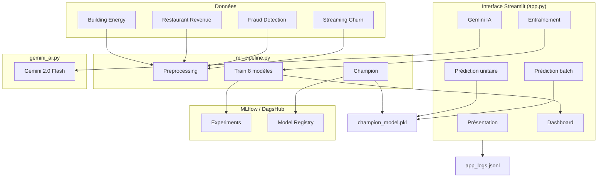
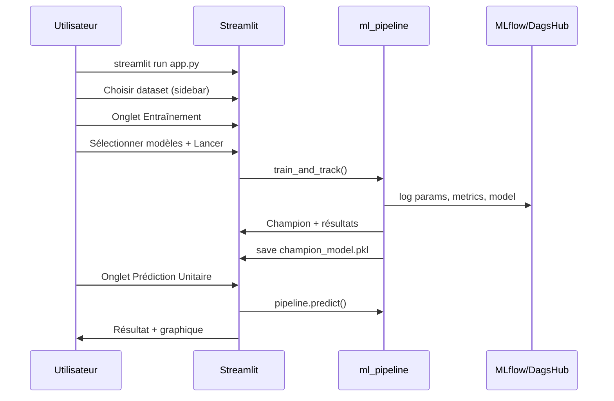

# 🧠 AI Business Intelligence — Documentation complète (français)

> **Plateforme MLOps** : interface Streamlit · 4 datasets métier · 8 modèles ML · tracking MLflow/DagsHub · prédictions · Google Gemini · journal d’actions.

Ce guide explique **tout le fonctionnement** de l’application pour que tu puisses l’utiliser et la **présenter** devant un jury ou un client.

---

## Table des matières

1. [Vue d’ensemble](#1-vue-densemble)
2. [Architecture technique](#2-architecture-technique)
3. [Installation](#3-installation)
4. [Structure du projet](#4-structure-du-projet)
5. [Les 4 datasets](#5-les-4-datasets)
6. [Les 8 modèles ML](#6-les-8-modèles-ml)
7. [Barre latérale (sidebar)](#7-barre-latérale-sidebar)
8. [Les 6 pages (onglets) — détail complet](#8-les-6-pages-onglets--détail-complet)
9. [Workflows complets](#9-workflows-complets)
10. [Modèle Champion & MLflow](#10-modèle-champion--mlflow)
11. [Métriques expliquées](#11-métriques-expliquées)
12. [Journal des actions (logs)](#12-journal-des-actions-logs)
13. [Scénario de démo (10 min)](#13-scénario-de-démo-10-min)
14. [Dépannage](#14-dépannage)
15. [Tests automatiques](#15-tests-automatiques)

---

## 1. Vue d’ensemble

### Problème métier

Les entreprises collectent beaucoup de données (énergie, ventes, fraude, abonnements) mais ont du mal à :
- les **comprendre** rapidement ;
- en faire des **prédictions** fiables ;
- **documenter** chaque expérience machine learning.

### Solution proposée

Une application web unique qui enchaîne :

```
Données CSV → Nettoyage → Entraînement (plusieurs modèles) → Meilleur modèle (Champion)
     → Prédictions (unitaire ou batch) → Analyse IA (Gemini) → Visualisations + Logs
```

### Ce que fait chaque couche

| Couche | Technologie | Rôle |
|--------|-------------|------|
| **Interface** | Streamlit | 6 onglets, formulaires, graphiques interactifs |
| **Données** | pandas + 4 CSV | Chargement et exploration |
| **ML** | scikit-learn, XGBoost | Entraînement, preprocessing, métriques |
| **MLOps** | MLflow + DagsHub | Suivi distant des expériences et registre de modèles |
| **IA générative** | Google Gemini | Réponses en langage naturel sur les données |
| **Traçabilité** | `logger.py` | Fichier `app_logs.jsonl` |

---

## 2. Architecture technique



### Fichiers du dépôt

| Fichier | Description |
|---------|-------------|
| `app.py` | Application Streamlit complète (696 lignes, 6 onglets) |
| `config.py` | Datasets, modèles, clés API (`.env` ou secrets Streamlit) |
| `ml_pipeline.py` | Preprocessing, entraînement, MLflow, gestion du Champion |
| `gemini_ai.py` | 3 fonctions : analyse dataset, prédiction, batch |
| `logger.py` | Écriture/lecture des logs JSONL |
| `test_app.py` | Tests automatiques (imports, données, OLS) |
| `requirements.txt` | Dépendances Python (inclut `statsmodels` pour les trendlines Plotly) |
| `*.csv` | 4 jeux de données réalistes |

---

## 3. Installation

### Prérequis

- Python **3.11+** (compatible 3.13)
- Compte **DagsHub** + token (MLflow distant)
- Clé **Google Gemini** (onglet IA — optionnel si quota disponible)

### Étapes

```bash
git clone https://github.com/aminexfrad/ai_business_app.git
cd ai_business_app
pip install -r requirements.txt
```

### Fichier `.env` (racine du projet)

```env
DAGSHUB_USERNAME=aminexfrad
DAGSHUB_TOKEN=votre_token_dagshub
DAGSHUB_REPO_NAME=ai_business_app
GOOGLE_API_KEY=votre_cle_gemini
```

### Lancer l’application

```bash
streamlit run app.py
```

Ouvre : **http://localhost:8501**

### Vérifier que tout fonctionne

```bash
python test_app.py
```

Tu dois voir : `ALL CHECKS PASSED`

---

## 4. Structure du projet

```
ai_business_app/
├── app.py                          # Interface principale
├── config.py                       # Configuration centralisée
├── ml_pipeline.py                  # Pipeline ML + MLflow
├── gemini_ai.py                    # Intégration Gemini
├── logger.py                       # Logs MLOps
├── test_app.py                     # Tests smoke
├── requirements.txt
├── building_energy_regression_realistic.csv
├── restaurant_revenue_regression_realistic.csv
├── fraud_detection_classification_realistic.csv
├── streaming_subscription_classification_realistic.csv
├── README.fr.md                    # Ce fichier
├── README.ar.md                    # Guide en arabe
└── .streamlit/config.toml          # Thème Streamlit
```

---

## 5. Les 4 datasets

Sélection dans la **sidebar** → le reste de l’app s’adapte (modèles, cible, graphiques).

### 🏢 Building Energy (Régression)

| | |
|---|---|
| **Fichier** | `building_energy_regression_realistic.csv` |
| **Lignes** | 850 |
| **Cible** | `energy_consumption` (consommation énergétique) |
| **Usage** | Optimiser la consommation des bâtiments selon surface, température, occupation, etc. |

### 🍽️ Restaurant Revenue (Régression)

| | |
|---|---|
| **Fichier** | `restaurant_revenue_regression_realistic.csv` |
| **Lignes** | 800 |
| **Cible** | `monthly_revenue` |
| **Usage** | Prévoir le chiffre d’affaires selon clients, commandes, marketing, etc. |

### 🔍 Fraud Detection (Classification)

| | |
|---|---|
| **Fichier** | `fraud_detection_classification_realistic.csv` |
| **Lignes** | 900 |
| **Cible** | `fraud` (0 = normal, 1 = fraude) |
| **Usage** | Scorer les transactions en temps réel |

### 📺 Streaming Churn (Classification)

| | |
|---|---|
| **Fichier** | `streaming_subscription_classification_realistic.csv` |
| **Lignes** | 750 |
| **Cible** | `subscription_cancelled` |
| **Usage** | Identifier les abonnés à risque de résiliation |

---

## 6. Les 8 modèles ML

Le type de modèles affichés dépend de la tâche du dataset sélectionné.

### Régression (prédire un nombre)

| Modèle | Idée |
|--------|------|
| Linear Regression | Relation linéaire simple, rapide |
| Random Forest Regressor | Ensemble d’arbres, capture les non-linéarités |
| Gradient Boosting Regressor | Boosting séquentiel, souvent très performant |
| XGBoost Regressor | Implémentation optimisée du gradient boosting |

### Classification (prédire une classe)

| Modèle | Idée |
|--------|------|
| Logistic Regression | Probabilités de classes, baseline solide |
| Random Forest Classifier | Arbres + vote majoritaire |
| Gradient Boosting Classifier | Boosting pour classification |
| XGBoost Classifier | XGBoost pour classes binaires/multiples |

### Preprocessing automatique (avant chaque entraînement)

1. Suppression des lignes où la **cible** est manquante  
2. **Imputation** : médiane (numérique), mode (catégoriel)  
3. **Standardisation** des variables numériques  
4. **One-Hot Encoding** des variables catégorielles  
5. Split **80 % train / 20 % test** (`random_state=42`)

---

## 7. Barre latérale (sidebar)

Visible sur **toutes les pages**.

| Élément | Fonction |
|---------|----------|
| **Select Dataset** | Change le CSV actif, la tâche et les modèles disponibles |
| **Task** | `regression` ou `classification` |
| **Target** | Nom de la colonne à prédire |
| **Shape** | Nombre de lignes × colonnes |
| **Bannière Champion** | Affiche le modèle actif ou un avertissement si aucun |
| **Load Champion from MLflow** | Recharge le meilleur modèle depuis le cloud DagsHub |
| **Liens** | DagsHub MLflow UI, dépôt GitHub |

---

## 8. Les 6 pages (onglets) — détail complet

---

### 🏠 Page 1 — Présentation

**Objectif :** Page d’accueil pour expliquer le projet (idéal pour commencer la soutenance).

**Contenu affiché :**
- Titre et sous-titre du projet (MLOps + IA générative)
- 4 métriques : nombre de datasets, modèles, types de tâches, déploiement
- Section « Problème traité » (liste à puces)
- Architecture en 4 couches : Données, ML, MLOps, Application
- Liste des 4 datasets (expanders avec description, lignes, colonnes)
- Technologies (badges : Python, Streamlit, MLflow, etc.)

**Actions utilisateur :** Lecture seule — aucun bouton critique.

**Phrase pour l’oral :**  
*« Cette page pose le contexte : une plateforme qui centralise l’analyse, l’entraînement traçable et les prédictions sur des données métier réelles. »*

---

### ⚙️ Page 2 — Entraînement & MLflow

**Objectif :** Entraîner, comparer et enregistrer les modèles dans MLflow.

**Contenu affiché :**
- Colonne gauche : multiselect des modèles + statistiques descriptives (`describe()`)
- Colonne droite : aperçu des 8 premières lignes + alertes (valeurs manquantes, variables catégorielles)
- Bouton principal : **« Lancer l’entraînement & Tracker avec MLflow »**

**Ce qui se passe au clic :**
1. Connexion DagsHub / MLflow  
2. Barre de progression par modèle  
3. Pour chaque modèle : création d’un **run** MLflow avec paramètres, métriques, artefact modèle  
4. Sélection du **Champion** (meilleur R² ou F1)  
5. Sauvegarde locale → `champion_model.pkl`  
6. Enregistrement dans le **Model Registry** MLflow  
7. Tableau comparatif + graphique en barres (métrique principale)  
8. Lien vers l’UI DagsHub  

**État session :** `trained_results`, `champion_pipeline`, `champion_name`, `champion_source`, `champion_run_id`

**Phrase pour l’oral :**  
*« Ici on compare objectivement plusieurs algorithmes ; le meilleur devient automatiquement le Champion et est versionné dans MLflow pour la reproductibilité. »*

---

### 🎯 Page 3 — Prédiction Unitaire

**Objectif :** Prédire **une seule observation** en saisissant les features à la main.

**Prérequis :** Modèle Champion chargé (session, fichier local, ou MLflow).

**Ordre de chargement du modèle :**
1. `st.session_state.champion_pipeline`  
2. Sinon `champion_model.pkl` (disque)  
3. Sinon message d’avertissement + `st.stop()`

**Contenu :**
- Bandeau vert : nom du Champion + source (Session / Local / MLflow)  
- Champs numériques (`st.number_input`) — min / max / médiane du dataset  
- Listes déroulantes pour les variables catégorielles  
- Bouton **« Prédire »**

**Résultat :**
- **Régression :** métrique avec valeur prédite formatée  
- **Classification :** libellé (Positif/Négatif) + barre de probabilités Plotly  
- Expander **Gemini** : interprétation métier de la prédiction  
- Log dans `app_logs.jsonl`

**Phrase pour l’oral :**  
*« Simulation d’un décideur qui saisit les caractéristiques d’un client ou d’un bâtiment et obtient une prédiction instantanée. »*

---

### 📦 Page 4 — Prédiction Batch CSV

**Objectif :** Scorer **des milliers de lignes** via un fichier CSV.

**Prérequis :** Champion chargé.

**Contenu :**
- Liste des colonnes attendues (features, sans la cible)  
- Bouton **télécharger template** (5 lignes exemple)  
- `file_uploader` pour CSV  
- Bouton **« Lancer la prédiction batch »**

**Résultat :**
- Tableau avec colonne `Prédiction` (+ `Confiance` si classification)  
- Téléchargement `predictions_batch.csv`  
- Histogramme des prédictions  
- Expander Gemini : résumé du batch  
- Log batch

**Phrase pour l’oral :**  
*« C’est le cas d’usage production : l’entreprise envoie un fichier, l’app renvoie les scores pour toute la base. »*

---

### 🤖 Page 5 — Analyse IA Générative (Gemini)

**Objectif :** Poser des questions en langage naturel sur le dataset actif.

**Prérequis :** `GOOGLE_API_KEY` valide + quota API.

**Contenu :**
- Statistiques descriptives  
- Liste des variables catégorielles  
- Questions rapides prédéfinies ou zone de texte libre  
- Bouton **« Analyser avec Gemini »**

**Modèle utilisé :** `gemini-2.0-flash` (dans `gemini_ai.py`)

**Types d’analyse Gemini dans l’app :**
| Fonction | Où |
|----------|-----|
| `analyze_dataset` | Onglet Gemini |
| `analyze_prediction_result` | Après prédiction unitaire |
| `analyze_batch_results` | Après prédiction batch |

**Phrase pour l’oral :**  
*« Gemini transforme les statistiques brutes en recommandations business compréhensibles par un manager non technique. »*

---

### 📊 Page 6 — Dashboard & Visualisations

**Objectif :** Explorer visuellement les données et l’historique MLOps.

**Sections (de haut en bas) :**

| Section | Contenu |
|---------|---------|
| **KPIs** | Lignes, nombre de features, cols numériques / catégorielles |
| **Distribution cible** | Histogramme (régression) ou camembert (classification) + box plot |
| **Matrice de corrélation** | Heatmap Plotly |
| **Feature vs cible** | Scatter + droite OLS (régression) ou box plot (classification) |
| **Variables catégorielles** | Histogramme de la variable choisie |
| **Comparaison modèles** | Si entraînement fait dans la session |
| **Journal des actions** | 30 dernières entrées + export CSV |

> **Note technique :** le scatter avec `trendline="ols"` nécessite le package **`statsmodels`** (déjà dans `requirements.txt`).

**Phrase pour l’oral :**  
*« Le dashboard permet l’exploration exploratoire des données avant et après modélisation, plus la traçabilité des actions. »*

---

## 9. Workflows complets

### Workflow A — Premier lancement (de zéro à prédiction)



| Étape | Action | Onglet |
|-------|--------|--------|
| 1 | Installer deps + `.env` | Terminal |
| 2 | `streamlit run app.py` | — |
| 3 | Choisir un dataset | Sidebar |
| 4 | Entraîner les modèles | Entraînement |
| 5 | Vérifier le Champion 🏆 | Entraînement |
| 6 | Faire une prédiction | Prédiction Unitaire |
| 7 | (Optionnel) Explorer les graphiques | Dashboard |
| 8 | (Optionnel) Question Gemini | Analyse IA |

---

### Workflow B — Reprendre une session (modèle déjà sur MLflow)

| Étape | Action |
|-------|--------|
| 1 | Lancer l’app |
| 2 | Sidebar → **Load Champion from MLflow** |
| 3 | Aller directement à Prédiction ou Batch |

---

### Workflow C — Prédiction batch entreprise

| Étape | Action |
|-------|--------|
| 1 | Champion chargé |
| 2 | Onglet Batch → Télécharger template |
| 3 | Remplir le CSV (mêmes colonnes que le dataset sans la cible) |
| 4 | Upload + Lancer batch |
| 5 | Télécharger `predictions_batch.csv` |

---

### Workflow D — Analyse exploratoire sans entraînement

| Étape | Action |
|-------|--------|
| 1 | Choisir dataset |
| 2 | Onglet Dashboard uniquement |
| 3 | (Optionnel) Onglet Gemini pour insights textuels |

---

## 10. Modèle Champion & MLflow

### Qu’est-ce que le Champion ?

Le modèle qui obtient la **meilleure métrique** parmi tous ceux entraînés dans la session :
- Régression → **R² maximal**
- Classification → **F1 maximal**

### Où est-il stocké ?

| Emplacement | Fichier / URI |
|-------------|---------------|
| **Session Streamlit** | `st.session_state.champion_pipeline` |
| **Disque local** | `champion_model.pkl` (gitignored) |
| **MLflow Registry** | `champion_model@champion` sur DagsHub |

### Fonctions clés (`ml_pipeline.py`)

| Fonction | Rôle |
|----------|------|
| `train_and_track()` | Entraîne N modèles + log MLflow |
| `get_champion()` | Retourne le meilleur |
| `save_champion_locally()` | Sauvegarde joblib |
| `load_champion_locally()` | Charge depuis disque |
| `register_champion_in_mlflow()` | Publie dans le Registry |
| `load_champion_from_mlflow()` | Charge depuis le cloud |

---

## 11. Métriques expliquées

### Régression

| Métrique | Signification | Bonne valeur |
|----------|---------------|--------------|
| **RMSE** | Erreur quadratique moyenne (racine) | Plus bas = mieux |
| **MAE** | Erreur absolue moyenne | Plus bas = mieux |
| **R²** | % de variance expliquée | Proche de **1** = excellent |

### Classification

| Métrique | Signification |
|----------|---------------|
| **Accuracy** | % de prédictions correctes |
| **F1** | Moyenne harmonique précision/rappel (utilisé pour le Champion) |
| **Precision** | Parmi les positifs prédits, combien sont vrais |
| **Recall** | Parmi les vrais positifs, combien sont détectés |
| **AUC** | Qualité du classement (courbe ROC) |

---

## 12. Journal des actions (logs)

Fichier : **`app_logs.jsonl`** (une ligne JSON par événement)

| Type d’événement | Déclenché par |
|------------------|---------------|
| `training` | Fin d’entraînement |
| `prediction` | Prédiction unitaire |
| `batch_upload` | Prédiction batch |
| `gemini_query` | Requête Gemini |

Visible dans l’onglet **Dashboard** → section « Journal des actions ».

---

## 13. Scénario de démo (10 min)

| Temps | Action | Page |
|-------|--------|------|
| 0:00 | Introduction projet | Présentation |
| 0:30 | Choisir **Fraud Detection** | Sidebar |
| 1:00 | Montrer aperçu données | Entraînement |
| 1:30 | Entraîner 4 modèles | Entraînement |
| 4:00 | Tableau + graphique + lien DagsHub | Entraînement |
| 4:30 | Prédiction unitaire (transaction suspecte) | Prédiction |
| 5:30 | Heatmap + scatter | Dashboard |
| 6:30 | Question Gemini | Analyse IA |
| 7:30 | (Optionnel) Upload batch 5 lignes | Batch |
| 8:30 | Montrer les logs | Dashboard |
| 9:30 | Conclusion MLOps + déploiement Streamlit Cloud | Présentation |

---

## 14. Dépannage

| Erreur | Cause | Solution |
|--------|-------|----------|
| `No module named 'statsmodels'` | Dépendance manquante pour trendline OLS | `pip install -r requirements.txt` |
| `No champion loaded` | Pas encore entraîné | Onglet Entraînement ou Load from MLflow |
| Erreur MLflow / DagsHub | Token ou username incorrect | Vérifier `.env` |
| Gemini 404 | Ancien nom de modèle | Utiliser `gemini-2.0-flash` dans `gemini_ai.py` |
| Gemini 429 | Quota API épuisé | Google AI Studio → facturation ou attendre |
| Dataset not found | Mauvais répertoire de lancement | `cd` vers le dossier du projet |
| Page blanche Streamlit | Premier chargement lent | Attendre 10–20 s et rafraîchir |

---

## 15. Tests automatiques

```bash
python test_app.py
```

Vérifie :
- Tous les imports (dont `statsmodels`)
- Chargement des 4 CSV
- Preprocessing sur chaque dataset
- Trendline OLS Plotly
- Chargement du champion local (si présent)

---

## Liens

- **GitHub :** https://github.com/aminexfrad/ai_business_app  
- **DagsHub MLflow :** https://dagshub.com/aminexfrad/ai_business_app.mlflow  
- **Google AI Studio :** https://aistudio.google.com/  

---

*Projet MLOps — Examen TP 2024 — aminexfrad*
